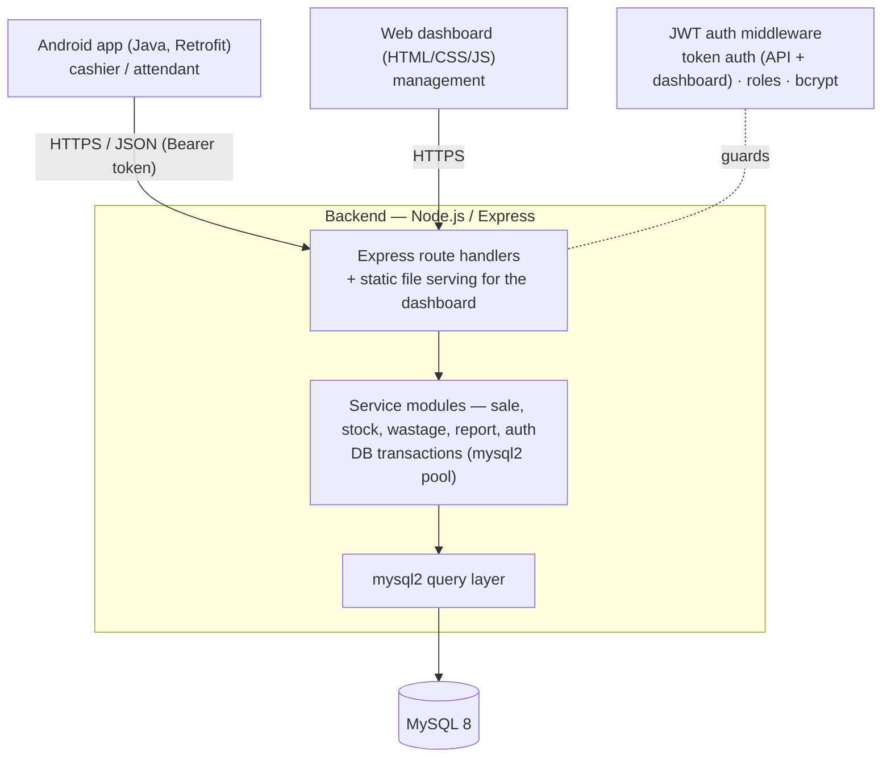

# Architecture

**Smart Butchery Inventory Management System (SBIMS)**

## 1. Overview

Three tiers, two client applications, one backend.

## 2. Tiers

| Tier | Contains | Responsibility |
|---|---|---|
| **Presentation** | Android app; web dashboard | Capture input, call the backend, show results. No business rules. |
| **Application / domain** | Express route handlers + service modules | Weight-based stock deduction, sale totalling, wastage, report queries, validation, transactions. |
| **Data access** | mysql2 query layer | Persistence and queries only. |
| **Database** | MySQL | The tables in `database-design.md` / `backend/database/schema.sql`. |
| **Cross-cutting** | JWT auth middleware (`jsonwebtoken` + `bcrypt`) | Token auth for the API and dashboard, role rules, password hashing. |

## 3. How the clients connect

- **Android app** → pure **REST/JSON**. Logs in at `POST /api/login`, stores
  the returned token, sends `Authorization: Bearer <token>` on every call.
- **Web dashboard** → standalone HTML/CSS/JS calling the same `/api/**`
  endpoints (decided — see the proposal's system architecture; no server-side
  templating, since the backend is Node not Java).

## 4. Indicative REST API

| Method & path | Purpose | Role |
|---|---|---|
| `POST /api/login` | Get an auth token | any |
| `GET /api/meat-types` · `GET /api/cuts` | List meat types / cuts with price and available kg | any |
| `POST /api/cuts` · `PUT /api/cuts/{id}` | Add / edit a cut (price, threshold) | MANAGER |
| `GET /api/stock` | Available weight per cut, grouped by meat type | any |
| `POST /api/deliveries` | Record a delivery (stock in) | any |
| `POST /api/sales` | Record a sale (lines: cutId + weightKg) → deducts stock | CASHIER |
| `GET /api/sales/today` | Today's kg sold and revenue | any |
| `POST /api/wastage` | Record spoilage / wastage | MANAGER |
| `GET /api/reports/sales?from=&to=` | Sales report | MANAGER |
| `GET /api/reports/profit?from=&to=` | Profit estimation | MANAGER |
| `GET /api/reports/stock-usage?from=&to=` | Stock-usage / wastage report | MANAGER |
| `GET /api/alerts/low-stock` | Cuts at or below threshold | MANAGER |
| `GET/POST /api/users` | List / create users | MANAGER |

(Final paths, request/response shapes and error codes still need pinning down
between Goodson and Josiphiah — tracked in issue #24 — and should be kept as a
Postman collection in the repo. Current schema field names live in
`backend/database/schema.sql`: `products`, `categories`, `stock_batches`,
`sales`, `wastage` — table/column names above such as `Cut`/`MeatType` are
provisional and should be reconciled against that file.)

## 5. Key design decisions

| Decision | Rationale |
|---|---|
| One Node.js/Express backend serving both clients | Android needs JSON; the dashboard is plain HTML/CSS/JS calling the same endpoints — no second server, no second language |
| Stock held as `products.stock_kg`, plus an append-only `stock_batches` table for deliveries | Fast reads and simple checks, with an audit trail of deliveries |
| One atomic transaction per stock-changing action | A sale/delivery/wastage never half-applies |
| Weight validated before commit; row lock on the product during a sale | Stock cannot go negative or be oversold under concurrency |
| `DECIMAL` columns for weight and money (see `schema.sql`) | No floating-point drift on kg × price |
| Sale rows store `unit_price` and `total_price` at time of sale | Past sales and reports stay correct after price changes |
| JWT auth for the API, bcrypt for passwords | Standard mobile-client auth; passwords never stored in the clear |

## 6. Technology

Node.js · Express · mysql2 · `jsonwebtoken` + `bcrypt` · MySQL 8 · npm ·
Android Studio + Java + Retrofit + Gradle · GitHub · Postman.

## 7. Deployment

Backend: a Node.js process (`node src/server.js`), connects directly to MySQL.
Web dashboard served statically (its own host, or via Express
`express.static`). Android app installed as an APK on the counter device,
pointed at the backend's base URL.
