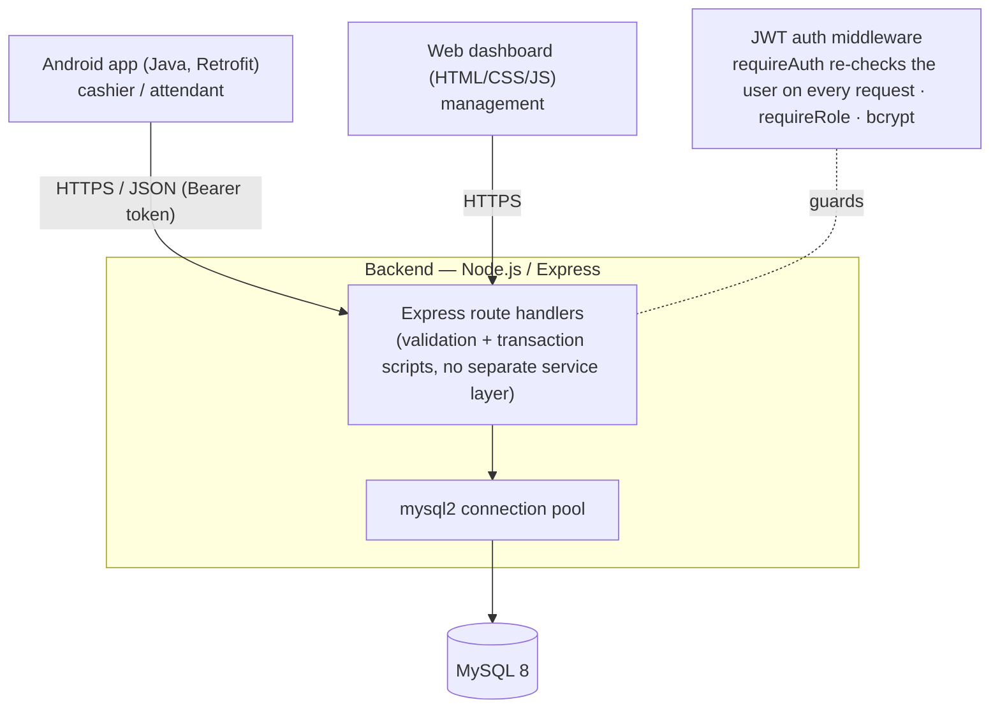

# Architecture

**Smart Butchery Inventory Management System (SBIMS)**

## 1. Overview

Three tiers, two client applications, one backend.

```mermaid
flowchart TD
    A["Android app (Java, Retrofit)<br/>cashier / attendant"]
    W["Web dashboard (HTML/CSS/JS)<br/>management"]
    subgraph S["Backend — Node.js / Express"]
      direction TB
      R["Express route handlers<br/>(validation + transaction scripts, no separate service layer)"]
      D["mysql2 connection pool"]
    end
    DB[("MySQL 8")]
    SEC["JWT auth middleware<br/>requireAuth re-checks the user on every request · requireRole · bcrypt"]

    A -- "HTTPS / JSON (Bearer token)" --> R
    W -- "HTTPS" --> R
    R --> D --> DB
    SEC -. guards .- R
```

## 2. Tiers

| Tier | Contains | Responsibility |
|---|---|---|
| **Presentation** | Android app; web dashboard | Capture input, call the backend, show results. No business rules. |
| **Application / domain** | Express route handlers (`backend/src/routes/`) | Weight-based stock deduction, sale totalling, wastage approval, report queries, validation, transactions. Each handler owns its own transaction script — see `design-class-diagram.md` for why there's no separate service/repository layer. |
| **Data access** | `mysql2` connection pool (`backend/src/config/db.js`) | A single shared pool; persistence and queries only. |
| **Database** | MySQL | The tables in `database-design.md` / `backend/database/schema.sql`. |
| **Cross-cutting** | JWT auth middleware (`jsonwebtoken` + `bcrypt`) | Token auth for the API, role rules, password hashing. `requireAuth` re-reads the user's current role/active status from the database on every request, so a deactivation or role change takes effect immediately rather than only once the token expires. |

## 3. How the clients connect

- **Android app** → pure **REST/JSON**. Logs in at `POST /api/login`, stores
  the returned token, sends `Authorization: Bearer <token>` on every call.
- **Web dashboard** → standalone HTML/CSS/JS calling the same `/api/**`
  endpoints — no server-side templating, since the backend is Node, not Java.
  Published separately as a static site via GitHub Pages (see §7).

## 4. REST API

Actual, implemented paths — this table previously listed provisional names
(`/api/cuts`, `/api/meat-types`) from before the schema was finalised; it now
matches `backend/database/schema.sql` and the route files under
`backend/src/routes/` directly.

| Method & path | Purpose | Role |
|---|---|---|
| `POST /api/login` | Get an auth token | any |
| `GET /api/products` | List active products (`?all=true`: admin also sees deactivated ones), joined with `category_name` | any |
| `POST /api/products` · `PUT /api/products/:id` | Create / edit a product (price, cost, threshold, barcode, active) | admin |
| `GET /api/categories` · `POST /api/categories` | List / add categories | any (post: admin) |
| `POST /api/stock-batches` | Record a delivery (stock in) → increases stock | admin |
| `POST /api/sales` | Record a single-line sale → deducts stock | any |
| `POST /api/sales/batch` | Record a multi-item cart atomically (all lines or none) | any |
| `GET /api/sales/today` | Today's kg sold and revenue | any |
| `POST /api/wastage` | Report wastage — PENDING for a cashier (no stock change), auto-APPROVED for an admin | any |
| `GET /api/wastage?status=` | List wastage reports (cashier: own only; admin: all, filterable by status) | any |
| `POST /api/wastage/:id/approve` · `/reject` | Approve (deducts stock) or reject a pending report | admin |
| `GET /api/alerts/low-stock` | Products at or below threshold | any |
| `GET /api/reports/sales` · `/profit` · `/stock-usage` | Reports, each accepting `?from=&to=` (default: last 7 days, shop-local date) | admin |
| `GET /api/users` · `POST /api/users` | List / create user accounts | admin |
| `PUT /api/users/:id` | Change role / activate / deactivate (self-demote and the last active admin are protected) | admin |
| `POST /api/users/:id/password` | Reset a user's password | admin |

## 5. Key design decisions

| Decision | Rationale |
|---|---|
| One Node.js/Express backend serving both clients | Android needs JSON; the dashboard is plain HTML/CSS/JS calling the same endpoints — no second server, no second language |
| No separate service/repository layer — each route handler is its own transaction script | Every operation is used from exactly one route against one fixed schema; a layered split would mean more files to keep in sync for the same behaviour. See `design-class-diagram.md`. |
| Stock held as `products.stock_kg` (a stored running balance), plus append-only `stock_batches`/`sales`/`wastage` tables | Fast reads; each table already carries weight, timestamp and responsible user, so a full movement history is reconstructible without a separate ledger table (see `database-design.md`, reworded FR12) |
| One atomic transaction per stock-changing action, using a conditional `UPDATE ... WHERE stock_kg >= ?` rather than read-then-write | A sale/delivery/wastage approval never half-applies, and two concurrent requests cannot both oversell the same product |
| `DECIMAL` columns for weight and money | No floating-point drift on kg × price |
| Sale rows store `unit_price` and `total_price` at time of sale | Past sales and reports stay correct after a price change |
| Wastage requires manager approval before stock moves | A cashier's write-off alone was judged too easy to abuse; added in PR #47 |
| `requireAuth` re-reads the user's role/active status on every request | A deactivated account or demoted admin loses access immediately, not after a 12h token expires |
| JWT auth for the API, bcrypt for passwords | Standard mobile-client auth; passwords never stored in the clear |
| `BUSINESS_TIMEZONE` env var (default `+02:00`, Zambia, no DST) set on every DB connection | Without it, `DATE()`/`CURDATE()` ran in the host's UTC clock, so a sale between midnight and 2am local time was misattributed to the previous day in reports and in `/sales/today` (PR #46) |

## 6. Technology

Node.js · Express · mysql2 · `jsonwebtoken` + `bcrypt` · MySQL 8 · npm ·
Jest + Supertest (backend API tests) · Android Studio + Java + Retrofit +
Gradle · GitHub (branches, PRs, issues as the task board) · Postman.

## 7. Deployment

- **Backend + MySQL**: deployed on [Railway](https://railway.app), auto-
  deploying on every push to `main` via a GitHub App connection. Live URL:
  `https://smart-butchery-inventory-management-system-production.up.railway.app`.
  `BUSINESS_TIMEZONE` defaults to `+02:00` and does not need to be set
  explicitly on Railway unless the shop moves to a different time zone.
- **Web dashboard**: a static site published via **GitHub Pages** from the
  `gh-pages` branch, at `https://goodson-jr.github.io/Smart-Butchery-Inventory-Management-System/`.
  It is a separate build output from `web-dashboard/` on `main` — changes to
  the dashboard's source are not live until `gh-pages` is rebuilt/republished.
- **Android app**: built in Android Studio and installed as an APK on the
  counter device, pointed at the Railway backend's base URL
  (`android-app/.../network/ApiClient.java`).
- **Local development**: see `backend/README.md` / the repo root `README.md`
  for running the backend and a local MySQL instance against
  `backend/database/schema.sql`.
