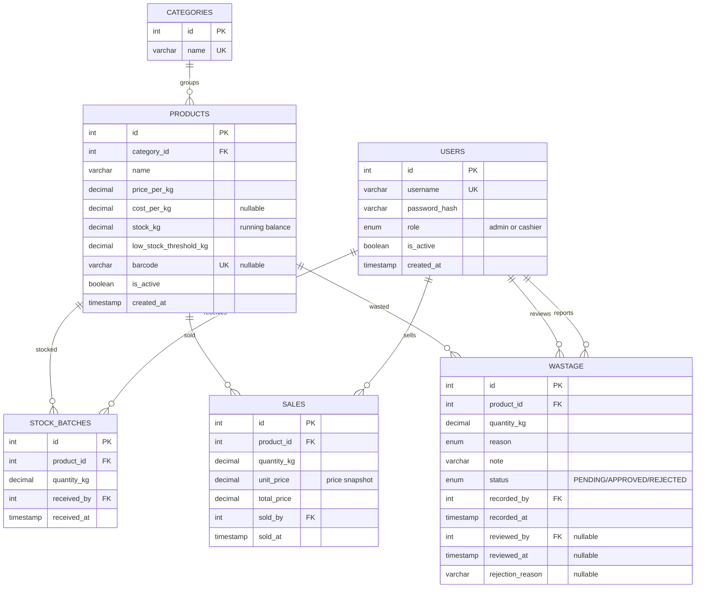

# Database Design

**Smart Butchery Inventory Management System (SBIMS)**

This document describes the database as actually implemented at
`backend/database/schema.sql` (the source of truth — this document explains
and justifies it, rather than the other way around). An earlier draft of this
file described a different, unbuilt design (`cut`, `meat_type`, `sale_line`,
`stock_movement`); that design was superseded during implementation, and
`high-level-requirements.md` (FR12, FR16, NFR3) has been reworded to match
what was actually built. See that file's "Assumptions & constraints" section
for the reasoning.

## 1. Entity-Relationship Diagram

## 2. Data dictionary

### `users`
| Column | Type | Notes |
|---|---|---|
| `id` | `INT AUTO_INCREMENT PK` | |
| `username` | `VARCHAR(50) UNIQUE NOT NULL` | |
| `password_hash` | `VARCHAR(255) NOT NULL` | bcrypt, never returned by any API response |
| `role` | `ENUM('admin','cashier') NOT NULL` | checked by `requireRole()` middleware |
| `is_active` | `BOOLEAN NOT NULL DEFAULT TRUE` | deactivated, never deleted — history (sales/stock/wastage) stays attached to a real user; `requireAuth` re-reads this on every request, so deactivation takes effect immediately, not only at next login |
| `created_at` | `TIMESTAMP DEFAULT CURRENT_TIMESTAMP` | |

### `categories`
| Column | Type | Notes |
|---|---|---|
| `id` | `INT AUTO_INCREMENT PK` | |
| `name` | `VARCHAR(50) UNIQUE NOT NULL` | e.g. Beef, Chicken, Pork |

### `products`
| Column | Type | Notes |
|---|---|---|
| `id` | `INT AUTO_INCREMENT PK` | |
| `category_id` | `INT NOT NULL, FK -> categories.id` | |
| `name` | `VARCHAR(100) NOT NULL` | the cut, e.g. "Ribs" |
| `price_per_kg` | `DECIMAL(10,2) NOT NULL` | selling price |
| `cost_per_kg` | `DECIMAL(10,2) NULL` | nullable — not every product has a recorded cost; the profit report flags how many active products are missing it rather than silently treating missing cost as zero |
| `stock_kg` | `DECIMAL(10,3) NOT NULL DEFAULT 0` | **stored running balance**, not derived — see Design Decision 1 |
| `low_stock_threshold_kg` | `DECIMAL(10,3) NOT NULL DEFAULT 5` | drives the low-stock alert |
| `barcode` | `VARCHAR(50) UNIQUE NULL` | nullable, unique when present |
| `is_active` | `BOOLEAN NOT NULL DEFAULT TRUE` | soft delete — retiring a cut hides it from sale without deleting its sales/wastage history |
| `created_at` | `TIMESTAMP DEFAULT CURRENT_TIMESTAMP` | |

### `stock_batches` (deliveries)
| Column | Type | Notes |
|---|---|---|
| `id` | `INT AUTO_INCREMENT PK` | |
| `product_id` | `INT NOT NULL, FK -> products.id` | |
| `quantity_kg` | `DECIMAL(10,3) NOT NULL` | |
| `received_by` | `INT NOT NULL, FK -> users.id` | who recorded the delivery |
| `received_at` | `TIMESTAMP DEFAULT CURRENT_TIMESTAMP` | |

### `sales`
| Column | Type | Notes |
|---|---|---|
| `id` | `INT AUTO_INCREMENT PK` | |
| `product_id` | `INT NOT NULL, FK -> products.id` | |
| `quantity_kg` | `DECIMAL(10,3) NOT NULL` | |
| `unit_price` | `DECIMAL(10,2) NOT NULL` | **snapshot** of `products.price_per_kg` at sale time |
| `total_price` | `DECIMAL(10,2) NOT NULL` | `quantity_kg * unit_price`, stored rather than recomputed |
| `sold_by` | `INT NOT NULL, FK -> users.id` | |
| `sold_at` | `TIMESTAMP DEFAULT CURRENT_TIMESTAMP` | |

A multi-item checkout (`POST /sales/batch`) writes one `sales` row per cart
line, all inside a single transaction — see Design Decision 3 for why lines
are not grouped under a parent sale record.

### `wastage`
| Column | Type | Notes |
|---|---|---|
| `id` | `INT AUTO_INCREMENT PK` | |
| `product_id` | `INT NOT NULL, FK -> products.id` | |
| `quantity_kg` | `DECIMAL(10,3) NOT NULL` | |
| `reason` | `ENUM('SPOILAGE','EXPIRY','TRIM','OTHER') NOT NULL DEFAULT 'OTHER'` | |
| `note` | `VARCHAR(255) NULL` | free-text detail, HTML-escaped by the web dashboard before display |
| `status` | `ENUM('PENDING','APPROVED','REJECTED') NOT NULL DEFAULT 'PENDING'` | stock is only deducted on `APPROVED` — see Design Decision 4 |
| `recorded_by` | `INT NOT NULL, FK -> users.id` | who reported it |
| `recorded_at` | `TIMESTAMP DEFAULT CURRENT_TIMESTAMP` | |
| `reviewed_by` | `INT NULL, FK -> users.id` | who approved/rejected it; null while PENDING |
| `reviewed_at` | `TIMESTAMP NULL` | |
| `rejection_reason` | `VARCHAR(255) NULL` | set only on rejection |

## 3. Design decisions

**1. `products.stock_kg` is a stored running balance, not derived.** Every
stock-changing endpoint (delivery, sale, wastage approval) updates this
column directly inside a transaction, rather than every stock lookup summing
`stock_batches - sales - wastage` on the fly. A current-stock read is a
single indexed column read, not an aggregation over the full history —
important once a shop has months of sales rows.

**2. Safe concurrent stock changes use an atomic conditional `UPDATE`, not a
read-then-write.** Deducting stock for a sale or approved wastage report is
always `UPDATE products SET stock_kg = stock_kg - ? WHERE id = ? AND
stock_kg >= ?` inside a transaction. The check and the write happen as one
atomic database operation, so two simultaneous sales of the last unit of a
product cannot both read "enough stock" and both succeed.

**3. Sale lines are independent rows, not grouped under a parent sale
record (reworded FR16).** The original plan had a `sale` header row with
child `sale_line` rows. What was actually built: `POST /sales/batch`
processes every cart line inside one transaction — all lines succeed
together or the whole cart rolls back — but each line is still its own
`sales` row, correlated only by `sold_at` and `sold_by`, not by a shared
`sale_id`. The atomicity guarantee FR16 cares about is fully there; the
"one receipt, one id" grouping is not. See `high-level-requirements.md`.

**4. Wastage requires manager approval before stock moves.** A cashier's
report is inserted as `PENDING` with no stock change; a manager's own report
is auto-approved. `POST /wastage/:id/approve` re-checks current stock (not
the stock at report time — it may have sold in between) inside the same
atomic-update pattern as a sale, and `POST /wastage/:id/reject` leaves stock
untouched. This was added after launch (PR #47) because an unreviewed
cashier write-off was judged too easy to abuse.

**5. No separate stock-movement ledger table (reworded FR12).** The
original plan had one `stock_movement` table that every stock-changing
action also wrote to. What was built instead: each action type has its own
table (`stock_batches`, `sales`, `wastage`), and each already carries the
weight, a timestamp, and the responsible user — the same information a
unified ledger would hold, just split by action type rather than merged
into one table. Reconstructing a full movement history means querying three
tables instead of one; nothing it would capture is actually missing.

**6. Weights are `DECIMAL(10,3)`, money is `DECIMAL(10,2)` — never
`FLOAT`.** Floating-point arithmetic can introduce small rounding errors
that would eventually make stock counts and sales totals fail to reconcile
exactly; `DECIMAL` stores both exactly.

## 4. Normalisation

Starting from a single flat "transaction sheet" record — the kind a manual
paper record would use — with repeating columns for category name, cut name,
price, and every stock event mixed together in one table:

- **1NF**: split the repeating stock-event group into its own rows. This is
  exactly why stock-in, sales, and wastage are three separate tables rather
  than one table with a "type" column and a pile of nullable columns for
  whichever fields don't apply to that type.
- **2NF**: `price_per_kg`, `cost_per_kg`, and `low_stock_threshold_kg`
  depend on the *product*, not on any individual stock event — pulling
  `products` out as its own table removes that partial dependency. Likewise
  `username`/`role` depend only on the user, not on the sale or delivery
  they're attached to — pulled out into `users`.
- **3NF**: `category.name` was a transitive dependency through
  `products.category_id` (a cut's category name depends on its category,
  not directly on the cut) — pulled out into its own `categories` table so
  renaming a category is a single-row update instead of a mass rewrite.

The two deliberate exceptions to full normalisation, and why:
- `sales.unit_price` **duplicates** `products.price_per_kg` at the moment of
  sale. This is intentional, not an oversight — a price change next month
  must never silently rewrite last month's sales revenue.
- `products.stock_kg` **duplicates** information technically derivable by
  summing `stock_batches`/`sales`/approved `wastage`. Also intentional —
  see Design Decision 1.

## 5. Schema source

The authoritative `CREATE TABLE` statements live in
[`backend/database/schema.sql`](../backend/database/schema.sql) (fresh
install) with incremental upgrade scripts in
[`backend/database/migrations/`](../backend/database/migrations/) for
existing databases. This document should be read as an explanation of that
file, not a separate spec — if they ever disagree, the schema file is right.
