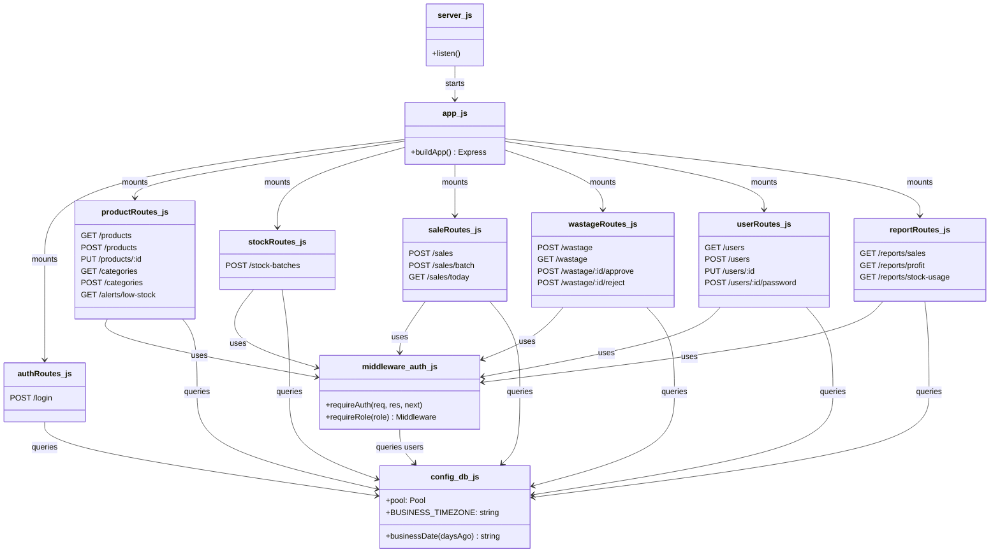

# Design Class Diagram

**Smart Butchery Inventory Management System (SBIMS)**

This describes the backend's actual module structure under
`backend/src/`. An earlier draft of this document planned a layered
architecture with separate `services/` and `db/` (repository) directories;
that layering was not built. What exists instead is deliberately flatter —
see "Why no service/repository layer" below.

## Module diagram

## Responsibilities

- **`server.js`** — the process entry point. Loads environment variables and
  starts the HTTP listener. Nothing else.
- **`app.js`** — the composition root. Builds the Express app, wires global
  middleware (`cors`, `express.json`), mounts every route module under
  `/api`, and registers the catch-all error handler. Contains no business
  logic itself.
- **`config/db.js`** — the single shared `mysql2` connection pool (a
  Singleton — every route module imports the same instance via Node's
  module cache), plus the `BUSINESS_TIMEZONE`-aware `businessDate()` helper
  used for default report date ranges.
- **`middleware/auth.js`** — `requireAuth` verifies the JWT and re-reads the
  user from the database on every request (so a deactivation or role change
  takes effect immediately, not when the token expires); `requireRole(role)`
  is a middleware factory producing a role-specific check.
- **Route modules** (`routes/*.js`) — one per resource. Each handler *is*
  the business logic for that operation: it validates input, opens a
  transaction when the operation changes stock, runs the necessary queries,
  and commits or rolls back. This is the Transaction Script pattern, not a
  layered Service/Repository split.

## Why no service/repository layer

The original plan separated route handlers from "services" (business logic)
from "repository" query modules. That layering earns its cost on a system
with business rules reused across many entry points, or where the data
layer needs to be swapped out. Neither applies here: every operation (record
a sale, approve wastage, deactivate a user) is used from exactly one route,
and the data layer is a single fixed MySQL schema for the whole project's
lifetime. Introducing three layers per feature would have meant more files
to keep in sync for the same behaviour, not more safety — so each route
handler owns its full transaction script directly. See `Backend.docx` /
`backend/src/` for worked examples (particularly the atomic multi-item
checkout and the wastage approval flow), which are the two handlers where
this pattern earns its keep most clearly: both need the same
validate → lock → transact → commit-or-rollback shape every time.

## Rules the diagram captures

- Every route module depends on `middleware/auth.js` and `config/db.js`;
  nothing depends on a route module.
- A DB transaction (`beginTransaction()` / `commit()` / `rollback()`) wraps
  every stock-changing operation: stock-in, single sale, batch checkout, and
  wastage approval.
- Stock deduction always uses an atomic conditional `UPDATE ... WHERE
  stock_kg >= ?` inside that transaction — never a separate read-then-write.
