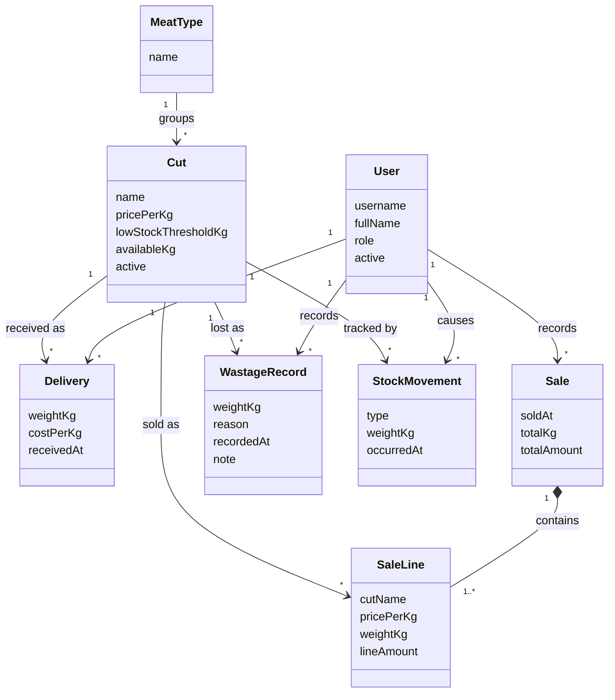

# Domain Model

**Smart Butchery Inventory Management System (SBIMS)**

> Conceptual model — business concepts, attributes and relationships. No methods,
> no keys, no data types. Add the drawn class diagram (draw.io) before hand-in;
> the Mermaid version below is the starting point.

## Concepts

| Concept | Meaning |
|---|---|
| **User** | A person who can log in — a cashier/attendant (Android) or a manager/admin (web). |
| **MeatType** | A kind of meat: Beef, Chicken, Pork, Goat. |
| **Cut** | A specific product under a meat type (Beef → Ribs, Steak, Mince), priced **per kilogram**, with a low-stock threshold and a current available weight. |
| **Delivery** | A recorded stock-in event: a weight of a cut received on a date, optionally with a cost per kg. |
| **Sale** | A completed counter transaction: one or more sale lines, a cashier, a date/time, totals. |
| **SaleLine** | One cut on a sale: the weight sold and the amount, with the cut name and price per kg captured at sale time. |
| **WastageRecord** | A recorded loss of a weight of a cut for a reason (spoilage, expiry, trim, other). |
| **StockMovement** | A ledger entry for every change to a cut's available weight — delivery, sale, wastage or manual adjustment — with the weight, time and user. |

## Relationships (Mermaid)

## Notes for the design

- **`Cut.availableKg`** is a stored running total, adjusted transactionally on
  every delivery / sale line / wastage / adjustment. `StockMovement` is the audit
  trail and lets the true balance be re-derived if needed.
- `SaleLine` stores `cutName` and `pricePerKg` as a **snapshot** so a past receipt
  or report stays correct after a price change.
- Reports (daily/weekly sales, profit, stock usage) are **queries** over `Sale`,
  `SaleLine`, `Delivery` and `WastageRecord` — not stored entities.
- Low-stock is a derived condition: `availableKg <= lowStockThresholdKg`.
