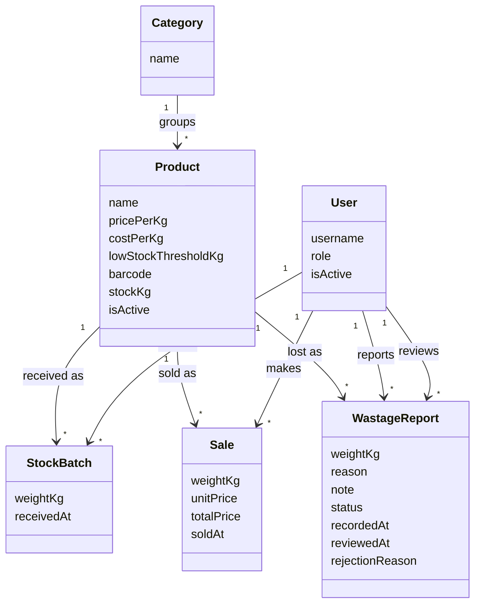

# Domain Model

**Smart Butchery Inventory Management System (SBIMS)**

Conceptual model — business concepts, attributes and relationships. This
reflects the system as actually built (`backend/database/schema.sql`); an
earlier draft described a `Sale`/`SaleLine`/`StockMovement` shape that was
not implemented — see `database-design.md` for why, and
`high-level-requirements.md` (FR12, FR16) for the reworded requirements.

## Concepts

| Concept | Meaning |
|---|---|
| **User** | A person who can log in — a cashier/attendant (Android) or an admin/manager (web + Android). Deactivated rather than deleted, so history stays attached to a real person. |
| **Category** | A kind of meat: Beef, Chicken, Pork, ... |
| **Product** | A specific cut under a category (Beef → Ribs, Steak, Mince), priced **per kilogram**, with an optional cost per kg, a low-stock threshold, an optional barcode, and a current available weight. Retired (soft-deleted) rather than deleted. |
| **StockBatch** | A recorded delivery: a weight of a product received, by whom, when. Increases available weight. |
| **Sale** | One product sold at one moment: a weight, the price per kg at that moment, and the resulting amount, by whom. A multi-item checkout produces several `Sale` rows written in one transaction (all succeed or none do) rather than one parent "sale" grouping several lines — see `database-design.md`, Design Decision 3. |
| **WastageReport** | A reported loss of a weight of a product for a reason (spoilage, expiry, trim, other), with a lifecycle: **PENDING** (reported, stock unchanged) → **APPROVED** (a manager confirmed it; stock is deducted at approval time, re-checked against what's actually left) or **REJECTED** (stock stays unchanged). A manager's own report is approved immediately. |

## Relationships (Mermaid)

```mermaid
classDiagram
    class User {
        username
        role
        isActive
    }
    class Category {
        name
    }
    class Product {
        name
        pricePerKg
        costPerKg
        lowStockThresholdKg
        barcode
        stockKg
        isActive
    }
    class StockBatch {
        weightKg
        receivedAt
    }
    class Sale {
        weightKg
        unitPrice
        totalPrice
        soldAt
    }
    class WastageReport {
        weightKg
        reason
        note
        status
        recordedAt
        reviewedAt
        rejectionReason
    }

    Category "1" --> "*" Product : groups
    Product "1" --> "*" StockBatch : received as
    Product "1" --> "*" Sale : sold as
    Product "1" --> "*" WastageReport : lost as
    User "1" --> "*" StockBatch : records
    User "1" --> "*" Sale : makes
    User "1" --> "*" WastageReport : reports
    User "1" --> "*" WastageReport : reviews
```

## Notes for the design

- **`Product.stockKg`** is a stored running total, adjusted transactionally
  on every delivery, sale, and approved wastage report — not recomputed by
  summing history on every read. See `database-design.md`, Design Decision 1.
- **`Sale.unitPrice`** is a **snapshot** of the product's price at the
  moment of sale, so a past receipt or report stays correct after a price
  change.
- A **`WastageReport`** only affects `stockKg` at the moment it becomes
  APPROVED, and that deduction re-checks current stock rather than trusting
  the stock level at the time it was reported — stock may have sold in the
  meantime. Approving an already-APPROVED or REJECTED report, or approving
  when there's no longer enough stock left, is refused.
- Reports (daily/weekly sales, profit, stock usage) are **queries** over
  `Sale`, `StockBatch`, and `WastageReport` — not stored entities of their
  own.
- Low-stock is a derived condition: `stockKg <= lowStockThresholdKg`.
- There is no separate `StockMovement` ledger concept — `StockBatch`,
  `Sale`, and `WastageReport` together already record every stock change
  with its weight, timestamp, and responsible user; a full movement history
  means querying the three of them rather than one unified table. See the
  reworded FR12 in `high-level-requirements.md`.
