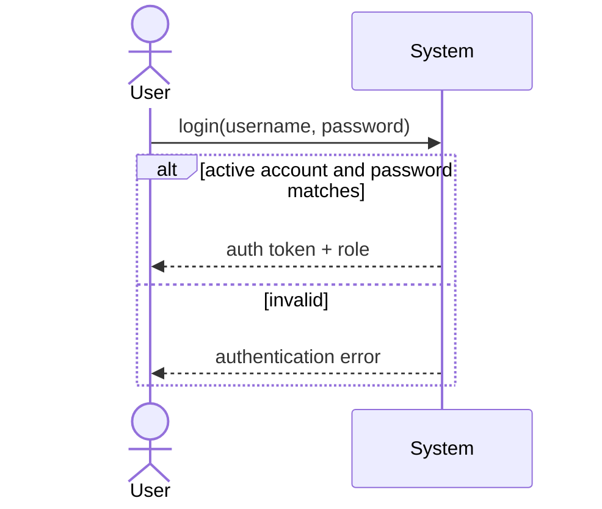
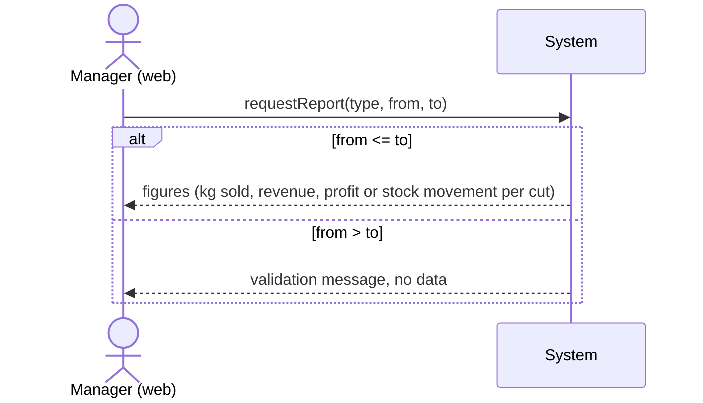

# System Sequence Diagrams

**Smart Butchery Inventory Management System (SBIMS)**

Each diagram shows the events between an actor and the system (black box) for one
scenario in `detailed-use-cases.md`.

---

## SSD1 — Log In (UC1)



---

## SSD2 — Record Sale (UC2)

```mermaid
sequenceDiagram
    actor C as Cashier (Android)
    participant S as System
    C->>S: startNewSale()
    S-->>C: cuts with price per kg and available kg
    loop for each cut sold
        C->>S: addLine(cutId, weightKg)
        S-->>C: line amount, running total
    end
    C->>S: completeSale()
    alt every line weight <= that cut's available kg
        S-->>C: sale saved (id, total kg, total amount); stock deducted
    else a line exceeds available stock
        S-->>C: error "insufficient stock for <cut>"; nothing saved
    end
```

---

## SSD3 — Add Stock / Record Delivery (UC3)

```mermaid
sequenceDiagram
    actor U as User
    participant S as System
    U->>S: recordDelivery(cutId, weightKg, costPerKg?)
    alt weightKg > 0
        S-->>U: new available kg for the cut
    else weightKg <= 0
        S-->>U: validation error; nothing saved
    end
```

---

## SSD4 — Record Wastage (UC5)

```mermaid
sequenceDiagram
    actor M as Manager (web)
    participant S as System
    M->>S: recordWastage(cutId, weightKg, reason, note?)
    alt 0 < weightKg <= available kg
        S-->>M: wastage saved; available kg reduced
    else invalid weight
        S-->>M: error; nothing saved
    end
```

---

## SSD5 — Generate Reports (UC7)


